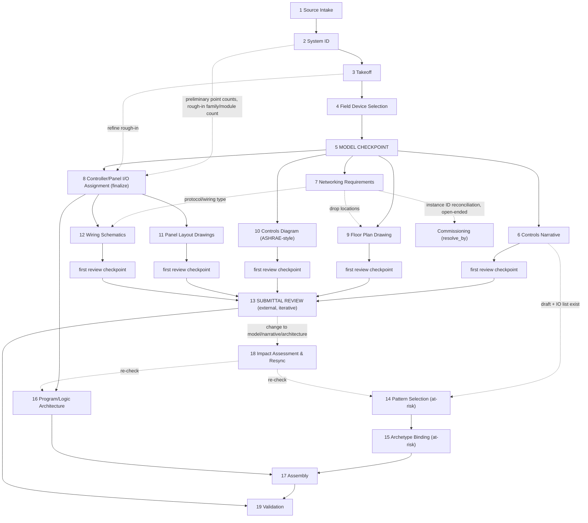

# Controls Engineering Playbook

<!--
MASTER PROCESS PLAYBOOK.
playbook_subtype "process" is not yet in the framework's playbook template;
the section layout below adapts it. Candidate framework change: a process-playbook template.
-->

## 1. Purpose and Use

This playbook defines **how KIS Solutions takes a controls project from mechanical design documents to validated control logic**. It is the entry point for every project and the router to every other page in this repository.

It covers the whole controls engineering workflow: takeoff, submittal drawings, and logic generation. These are not one straight line — after the model is approved, the work forks into several parallel tracks that converge at an external Submittal Review milestone, while logic generation can begin, provisionally, before that milestone closes.

---

## 2. Design Intent

- **One source of truth.** The canonical model is the project record. The device list, I/O list, networking table, and narrative skeleton are generated views of it, never edited separately.
- **Facts before decisions.** What the documents say is recorded separately from what we decide.
- **Every fact is traceable.** Every model attribute carries the source document, sheet or section, and revision it came from. Conflicts become open items or RFIs that cite both sources.
- **Checkpoints are frozen.** Once a checkpoint is passed, downstream stages add to the model but never edit what was approved. Changing approved content reopens the checkpoint.
- **Behavior is not takeoff.** The model records what exists; the narrative describes what it does; logic implements the narrative.
- **Provisional work is allowed, but tracked.** Logic generation does not have to wait for external approval of drawings. Work done against an unapproved model or narrative is *at-risk* and explicitly marked as such; when the upstream item changes, an impact assessment finds and re-checks everything built against the earlier version.
- **Rough in early, finalize at the checkpoint.** Several decisions (controller family selection, logic generation) don't need to wait for a frozen layer to *start* — only to be *finalized*. Controller family and rough module count can be picked from preliminary point counts during takeoff, the way a PLC rack size is roughed in before the I/O list is locked. What a checkpoint actually guarantees is that the frozen layer is authoritative from that point on — not that no work happened before it.
- **Not every open item blocks the next gate.** An open item carries a `resolve_by` reference to the milestone it must close before. Most must close before the Model Checkpoint. Some (e.g., an owner's BACnet instance ID schema) can stay open through Submittal Review and are only required to close before Commissioning.

---

## 3. The Canonical Model

The canonical model is an XML document built from a standard element vocabulary (see [Canonical Model Vocabulary](../ontology/canonical-model/canonical-model-vocabulary.md)). It is organized by physical makeup: project → system → component → device → point, with features, dependencies, open items and source references attached where they apply.

It is built in **layers**. Each stage adds its own layer and does not edit earlier ones.

| Layer | Added by stage | Contains |
|---|---|---|
| Takeoff | 3 | What the documents show: systems, components, devices, points, features, dependencies — with sources |
| Selection | 4 | Engineering decisions on field devices: device chosen, range, sizing basis |
| Architecture | 8 | Controller/panel assignment, I/O terminals, addressing |

**Generated views**

| View | Available after | Used for |
|---|---|---|
| Draft device list, draft I/O list | Stage 4 | Team takeoff comparison at the model checkpoint |
| Open item / RFI log | Any stage | Tracking conflicts, missing information, and items still open past a checkpoint |
| Networking table (protocol/device, drop locations, instance IDs) | Stage 7 | Floor plan, wiring schematics, owner coordination |
| Final I/O list | Stage 8 | Construction documents, programming |

**Open items are not all equal.** Each carries a `resolve_by` attribute naming the milestone it must be closed before (e.g., `model_checkpoint`, `submittal_review`, `commissioning`). An item can legitimately stay open across a checkpoint if its `resolve_by` is a later milestone — see the BACnet Instance ID case in Stage 7.

---

## 4. Stage Map

Stages 1–5 are sequential. After the Model Checkpoint, the work **forks into parallel tracks** that converge at the Submittal Review milestone. Logic generation can start before that milestone closes, provisionally.

| # | Stage | Track | Output | Gate |
|---|---|---|---|---|
| 1 | Source Intake | sequential | Source inventory | — |
| 2 | System Identification | sequential | System inventory | — |
| 3 | Takeoff | sequential | Model: takeoff layer | — |
| 4 | Field Device Selection | sequential | Model: selection layer | — |
| 5 | **Model Checkpoint** | sequential | Approved model, draft lists, open item log | Team agreement, open items resolved or carried with a `resolve_by` |
| 6 | Controls Narrative | fork | Controls narrative | first review checkpoint |
| 7 | Networking Requirements | fork | Networking table; drop locations; instance ID log | first review checkpoint (instance IDs may stay open, `resolve_by: commissioning`) |
| 8 | Controller/Panel I/O Assignment | rough-in from 2/3, finalized after 5 | Model: architecture layer; final I/O list | Spare capacity check (G6) |
| 9 | Floor Plan Drawing | fork (from 5, uses 7) | Floor plan drawing | first review checkpoint |
| 10 | Controls Diagram | fork | ASHRAE-style controls diagram | first review checkpoint |
| 11 | Panel Layout Drawings | fork (from 8) | Panel layout drawings | first review checkpoint |
| 12 | Wiring Schematics | fork (from 8, uses 7) | Wiring schematics | first review checkpoint |
| 13 | **Submittal Review** | convergence | Approved submittal package | External: client / owner / MEP, iterative |
| 14 | Pattern Selection | parallel, at-risk | Pattern list with parameters | — |
| 15 | Archetype Binding | parallel, at-risk | Archetypes, variants, tokens filled | — |
| 16 | Program/Logic Architecture | parallel (needs 8) | Program segmentation, execution order | — |
| 17 | Assembly | parallel, at-risk | Controller code | — |
| 18 | Impact Assessment & Resync | triggered by 13 | Change impact list; re-validated 14–17 output | — |
| 19 | Validation | after model/narrative final | Validation report | Logic and field checks |

Stages 1–13 are specified below in detail. Stages 14–19 are specified at the level needed to run them; they will get full stage specs alongside the logic-pattern work.

---

## 5. Stage Specifications

Each stage states: entry criteria, inputs, knowledge to consult, decisions made (engineering or programming), output, exit criteria, and loop-back rules.

### Stage 1 — Source Intake

- **Entry:** project documents received.
- **Inputs:** everything available. See [Source Documents and Authority](../governance-and-doctrine/source-documents-and-authority.md) for the document types and what each governs.
- **Actions:**
  - Inventory every document with its identifier, revision and date.
  - Identify whether **approved equipment submittals** exist for any equipment. If they do, those units are designed around the submitted equipment (see Decision Gate G1).
  - Identify which specification governs each topic: Division 23 09 00 first, then other project spec sections, then client general specs.
- **Decisions:** none; this stage records.
- **Output:** source inventory.
- **Exit:** every document has an identifier and revision; submittal status known per equipment item.

### Stage 2 — System Identification

- **Entry:** source inventory complete.
- **Inputs:** mechanical schedules, controls diagrams, floor plans, risers, approved submittals.
- **Consult:** system playbooks in `design-playbooks/systems/` to classify each system.
- **Actions:**
  - List every piece of controlled equipment by tag.
  - Assign each a system type; this selects its system playbook.
  - Set feature flags (e.g., reheat, economizer, static pressure reset, fan drive type) with a source reference for each.
  - Group identical units into typicals with an instance list.
  - Record dependencies between systems (serves / served-by, shared signals).
- **Decisions:** system type and typical grouping — engineering.
- **Output:** system inventory (the top level of the model).
- **Exit:** every scheduled or diagrammed unit is accounted for.
- **Loop-back / escalate:** equipment type with no system playbook → stop and escalate (G2).

### Stage 3 — Takeoff

- **Entry:** system inventory complete.
- **Inputs:** controls diagrams, schedules, SOO, floor plans and keyed notes, elevations, risers, specifications, approved submittals.
- **Consult:** canonical model vocabulary; system playbook baseline for the system type (what a unit of this type normally has).
- **Actions:**
  - Build the takeoff layer for each system: components, devices, points, features, dependencies.
  - Record a source reference on every element and attribute.
  - Where two sources disagree, record both values with both sources and raise an open item (`resolve_by: model_checkpoint`). Do not pick one.
  - Where the system playbook baseline expects something the documents do not show, raise an open item rather than adding it.
  - Use standard vocabulary elements; anything outside the vocabulary follows the extension rule on the vocabulary page.
- **Decisions:** none. The takeoff layer contains facts only.
- **Output:** model, takeoff layer.
- **Exit:** every source document has been taken off; every element has a source.

### Stage 4 — Field Device Selection

*Not to be confused with Stage 8, Controller/Panel I/O Assignment — this stage selects sensors, switches and similar field devices, not controller hardware.*

- **Entry:** takeoff layer complete.
- **Inputs:** takeoff layer; schedules (capacities, maximum static pressures, etc.); specifications; approved submittals.
- **Consult:** device pages in knowledgebase_wikijs (`Devices/`).
- **Actions:** for each device, record in the selection layer the device chosen, its range, and the sizing basis (the scheduled value and source it was sized from).
- **Decisions:** device and range — engineering.
- **Output:** model, selection layer.
- **Exit:** every point used for control or visualization has a range and sizing basis.

### Stage 5 — Model Checkpoint

- **Entry:** takeoff and selection layers complete.
- **Actions:**
  - Run model-stage validation checks (`validation/`, stage = model).
  - Generate the draft device list, draft I/O list and open item log.
  - The team compares the draft lists against their own takeoffs of the source documents.
  - Issue RFIs for open items that need someone outside the team; record answers in the model with the answer as the source.
  - For each remaining open item, confirm its `resolve_by` — most must close now; some may legitimately carry forward.
- **Exit:** team agrees the model matches the documents; every open item is resolved or explicitly carried with an owner and a `resolve_by`.
- **After exit:** takeoff and selection layers are frozen. This unblocks Stages 6–10 (the fork).

### Stage 6 — Controls Narrative

- **Entry:** Model Checkpoint passed.
- **Inputs:** approved model; mechanical SOO (for comparison).
- **Consult:** system playbooks, logic patterns.
- **Actions:**
  - Build the narrative function by function from the approved model.
  - Where the narrative departs from the mechanical SOO, record the departure as an engineering decision (source: KIS judgment, cited against the SOO section it replaces).
- **Decisions:** functional behavior, SOO deviations — engineering.
- **Output:** controls narrative (draft, then internally reviewed).
- **Exit (first review checkpoint):** internally reviewed and considered submittal-ready.
- **Downstream:** as soon as a draft exists and the I/O list (Stage 5 output) is available, Stage 14 (Pattern Selection) may begin, at-risk (see Section 5A).

### Stage 7 — Networking Requirements

- **Entry:** Model Checkpoint passed.
- **Inputs:** approved model (device types, counts, locations); specifications (networking is often governed by client general specs where project specs are silent); owner's BACnet numbering schema, if one exists.
- **Actions:**
  - Build a device/protocol table: which devices communicate on which protocol (BACnet MS/TP, BACnet/IP, Modbus, hardwired, etc.).
  - Determine Ethernet drop count and locations; hand these to Stage 9 (Floor Plan Drawing) as an overlay.
  - Build the BACnet Instance ID table. Where the owner has an existing schema, this is negotiated with them.
- **Decisions:** protocol assignment — engineering; instance ID values — negotiated, not unilateral.
- **Output:** networking table; drop-location overlay; instance ID log.
- **Exit (first review checkpoint):** device/protocol table and drop locations are internally reviewed and ready to hand to Stages 9 and 12.
- **Open-ended sub-track:** the instance ID reconciliation with the owner is **not required to close before Submittal Review**. It is carried as an open item with `resolve_by: commissioning`, and stays open as long as it takes.

### Stage 8 — Controller/Panel I/O Assignment

*Not to be confused with Stage 4 — this stage assigns points to controller/panel hardware, not field devices to processes. Selecting the controller is closer to sizing a PLC rack: it is driven by I/O count and signal type, not by what the point does.*

This stage has a rough-in phase and a finalize phase — the same rough-in-early / finalize-at-checkpoint pattern in Section 2.

- **Rough-in phase**
  - **Entry:** as soon as System Identification (Stage 2) or Takeoff (Stage 3) gives preliminary point counts and signal types per system — does not need to wait for the Model Checkpoint.
  - **Actions:** pick a candidate controller family and rough module count per system/typical, the way a PLC rack size is roughed in before the I/O list is locked. Refine as takeoff proceeds.
  - **Output:** draft architecture layer, explicitly marked provisional.
- **Finalize phase**
  - **Entry:** Model Checkpoint passed (I/O list is now authoritative).
  - **Inputs:** approved model I/O count and types; panel constraints, including I/O in panels not fully in KIS's control (e.g., packaged unit controllers); standing spare-capacity policy per controller/module.
  - **Consult:** platform product-class pages (`platforms/<platform>/`) for controller and remote I/O module capacities.
  - **Actions:**
    - Assign each point to a controller or panel.
    - Size controller/panel hardware with standard spare capacity (policy to be formalized — see Open Decisions).
    - Finalize controller selection and quantities.
  - **Decisions:** controller/panel assignment, hardware sizing — engineering.
  - **Output:** model, architecture layer (final); final I/O list.
  - **Exit:** every point is assigned to a controller/panel with spare capacity accounted for. Unblocks Stages 11 and 12.
  - **Gate:** G6 governs what happens when a point is added or changed after this stage closes (see Section 6).

### Stage 9 — Floor Plan Drawing

- **Entry:** Model Checkpoint passed (component/device locations); Stage 7 drop-location overlay available for the final version.
- **Actions:** place devices and equipment at their takeoff locations; overlay Ethernet drop locations from Stage 7.
- **Output:** floor plan drawing.
- **Exit (first review checkpoint):** internally reviewed and submittal-ready.

### Stage 10 — Controls Diagram (ASHRAE-style)

- **Entry:** Model Checkpoint passed.
- **Actions:** render the model's points and device types (averaging sensor, airflow station type, DP switch, etc.) in ASHRAE-style diagram form.
- **Output:** controls diagram.
- **Exit (first review checkpoint):** internally reviewed and submittal-ready.

### Stage 11 — Panel Layout Drawings

- **Entry:** Stage 8 complete.
- **Output:** panel layout drawings.
- **Exit (first review checkpoint):** internally reviewed and submittal-ready.

### Stage 12 — Wiring Schematics

- **Entry:** Stage 8 complete; Stage 7 protocol/wiring-type information available.
- **Output:** wiring schematics.
- **Exit (first review checkpoint):** internally reviewed and submittal-ready.

### Stage 13 — Submittal Review

- **Entry:** Stages 6, 9, 10, 11 and 12 have each reached their first review checkpoint. (Stage 7's instance ID sub-track does not need to be closed — see Stage 7.)
- **Actions:** the combined package (narrative, floor plan, controls diagram, panel layout, wiring schematics) goes to client / owner / MEP for review. This is **external and iterative**; it may take anywhere from weeks to roughly a year, and does not resolve on a fixed schedule.
- **Output:** approved submittal package, or a set of requested changes.
- **On a requested change:** run Stage 18 (Impact Assessment & Resync) against whatever the change affects — model, narrative, or architecture layer.
- **Exit:** submittal package approved by all required reviewers.

### Stages 14–19 — Logic Generation (parallel, at-risk until approval)

Because the narrative and the final I/O list both come from the approved model (Stage 5), logic generation can begin as soon as Stage 6 has a draft — it does **not** need to wait for Stage 13 to close. Work done this way is **at-risk**: submittal review can still change a device, a signal type (e.g., 4–20 mA to something else), or add/remove a point.

- **14 Pattern Selection (at-risk):** choose logic patterns (behavior) for each narrative function. Marked at-risk until Stage 6 is submittal-approved.
- **15 Archetype Binding (at-risk):** choose platform code archetypes and variants; fill tokens from the model. At-risk until Stages 6 and 8 are both approved.
- **16 Program/Logic Architecture:** program segmentation and execution order within controllers already assigned by Stage 8. Needs Stage 8's assignment to plan against, even if provisionally.
- **17 Assembly (at-risk):** produce controller code from 15 and 16.
- **18 Impact Assessment & Resync:** triggered whenever Stage 13 (or a Stage 8 change under G6) changes the model, narrative, or architecture layer. Use source references to find every narrative function, pattern selection, archetype binding, or assembled code block that was built against the changed element, and re-validate or update each one.
- **19 Validation:** logic-stage and field-stage checks, run once the model and narrative the code was built against are final (Stage 13 closed, and any Stage 18 resync complete).

---

## 6. Decision Gates

- **G1 — Approved submittals exist for this equipment?**
  - **Yes** → take off I/O and networkable features from the submittal; design around the actual equipment. Where the submittal differs from the design documents, record the difference and its source.
  - **No** → take off from design documents.
- **G2 — Equipment type has a system playbook?**
  - **Yes** → continue.
  - **No** → stop; escalate for a new system playbook or a project-specific approach.
- **G3 — Sources disagree?**
  - **Yes** → record both, raise an open item. Never resolve by silent precedence unless a rule on the source authority page covers it.
- **G4 — Model checkpoint passed?**
  - **Yes** → continue to the fork (Stages 6–10).
  - **No** → loop back to the stage that owns the defect (takeoff or selection).
- **G5 — A later stage needs to change approved takeoff or selection content?**
  - **Yes** → reopen the model checkpoint for that item.
- **G6 — A point is added or changed after Stage 8 (Controller/Panel I/O Assignment) closes. Does it fit within existing spare capacity?**
  - **Yes** → **Field Change.** Update the model and the affected drawings; capture it in a later submittal revision. Approval is typically informal (word of mouth) rather than a full review cycle — but it still gets a source reference (field change, date, who approved it). No new controller/panel hardware is needed.
  - **No** → a new controller or panel is required (e.g., an additional peer controller on the network). This is an architecture change: reopen Stage 8, and it **reopens Submittal Review** for the affected tracks (typically panel layout, wiring schematics, and possibly the narrative/diagram if new functions are involved).

---

## 7. Common Failure Modes

- Adding "obviously needed" devices during takeoff instead of raising an open item.
- Resolving document conflicts by judgment and losing the source trail.
- Editing a generated list instead of the model.
- Starting behavior description before the model checkpoint.
- Confusing Stage 4 (Field Device Selection) with Stage 8 (Controller/Panel I/O Assignment) — different decisions, different stages.
- Building final logic against a draft model or narrative with no plan to re-check it when Submittal Review changes something (skipping Stage 18).
- Treating a field change as untracked because its approval was verbal — it still needs a source reference.
- Letting an open item's `resolve_by` default to "now" when it could legitimately wait (e.g., forcing BACnet instance ID resolution before Submittal Review when the owner's schema isn't settled yet).

---

## 8. Open Decisions

- **Spare capacity policy:** a standing percentage or point count of spare I/O per controller/remote I/O module, to size Stage 8 consistently across projects. Currently applied by judgment ("guides the hardware on most every project"); worth formalizing on the relevant platform page (e.g., `platforms/kmc/`).
- **Internal "first review checkpoint" criteria:** whether each of the five fork-track deliverables has the same internal reviewer/role, or a different one per deliverable type.
- **BACnet Instance ID negotiation process:** not yet formalized — how the owner's schema (if any) is requested, reconciled, and confirmed before Commissioning.
- **Commissioning:** referenced here as the milestone that closes out open items like instance IDs, but is not yet defined as a stage in this playbook.

---

## 9. Status and Stewardship

- **Status:** Draft
- **Last Review:** 2026-09
- **Owner:** KIS Solutions
