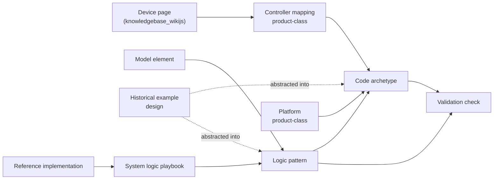

# Page Type Registry

This repository is a domain extension of the KIS knowledge framework. The framework itself (page taxonomy, metadata conventions, templates, reasoning model) is defined in the **knowledgebase_wikijs** repository, which is authoritative for structure. See its *Framework Extension Doctrine* and *AI Agent Framework Guide*.

Folders here organize **domains of knowledge**, following the framework layers. The engineering workflow is **not** encoded in folders; it lives in the [Controls Engineering Playbook](../design-playbooks/controls-engineering-playbook.md).

---

## 1. Framework Page Types Used Here

| Page type | Folder(s) | Template (knowledgebase_wikijs) | Answers |
|---|---|---|---|
| governance | `governance-and-doctrine/` | — | How this extension works; BAS vocabulary; source authority; naming |
| concept | `concepts/` | `templates/concept-template.md` | How control software behaves (execution, data flow, segmentation) |
| constraint-synthesis | `platforms/<platform>/`, future `concepts/constraints/` | `templates/template-constraint-synthesis.md` | The envelope of limits before choosing an implementation |
| playbook | `design-playbooks/`, platform convention pages | `templates/playbook-template.md` | What we do by default; the engineering workflow; per-system logic strategy |
| product-class | `platforms/<platform>/` | `templates/product-class-template.md` | What a controller platform implies and constrains |
| reference | `reference-implementations/` | `templates/reference-template.md` | Validated, complete worked systems (not universal standards) |
| design | `historical-examples/` | `templates/design-page-template.md` | What was built on a specific job — precedent only |

---

## 2. Extension Page Types

These exist because this extension produces a deliverable (control logic) with a menu-like, copy-ready nature that the parent framework does not cover.

| Page type | Parent type | Folder | Template (this repo) | AI role | Answers |
|---|---|---|---|---|---|
| model-element | ontology | `ontology/canonical-model/`, `ontology/narrative-model/` | `templates/model-element-template.md` | model_definition | What the canonical system model contains, and what is required of each element |
| logic-pattern | functional-construct | `ontology/logic-patterns/` | `templates/logic-pattern-template.md` | behavior_definition | What a control behavior must do, vendor-neutral, under all conditions |
| code-archetype | playbook | `code-archetypes/<platform>/` | `templates/code-archetype-template.md` | generation_source | The standard copy-ready implementation of a pattern on a platform: variant menu, tokens, code |
| validation-check | playbook | `validation/` | `templates/validation-check-template.md` | verification | One prescriptive check that catches one class of defect |

**Authority follows the parent type.** A code archetype is prescriptive like a playbook; a logic pattern is declarative like a functional construct.

---

## 3. How the Types Chain Together



- Behavior is defined once, on the logic pattern. Archetypes implement it; they never redefine it.
- Device facts stay in knowledgebase_wikijs. Controller mapping pages link to them and record only how logic uses the device.
- Historical examples are raw precedent. Patterns and archetypes are abstracted from them; examples never become rules directly.

---

## 4. Required Frontmatter

Every page carries at least:

```yaml
title: "<title>"
page_type: <type from the tables above>
parent_type: <required for extension types>
page_status: stub | draft | validated | deprecated
template: <template path>
```

Pages add the full metadata block from their template (`invocation_triggers`, `decision_axes`, `related_pages`, etc.) when they move past stub.

---

## 5. Adding a New Page Type

1. Confirm no framework or extension type already answers the question.
2. Choose a parent framework type.
3. Add a template in `templates/` and a row in Section 2.
4. If the type would be useful outside BAS logic, propose it as a generic template in knowledgebase_wikijs instead.
